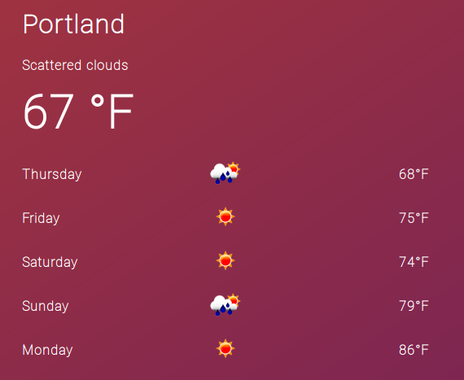

# Five Day Forecast With React

This React Redux application consumes data from [Open Weather Map](https://openweathermap.org/) and visualizes a 5 day forecast along with the current weather of Portland, OR.

The app starts by making a request to Open Weather Map. During the request, a loading screen is displayed. Once data has been received, the current weather and a five day forecast is made.

State is managed with Redux as a means to prepare for scaling as the app grows.

If I had more time, I would have worked longer on unit testing each component and on staggering each list item in.

## Getting Started

1. Clone this repository
1. run `npm install`
1. run `npm start`
1. A Browser will open a new tab and navigate to `localhost:3000`

## Built With

* [React](https://facebook.github.io/react/) - A View Library
* [Redux](http://redux.js.org/) - JavaScript State Container
* [Redux Thunk](https://github.com/gaearon/redux-thunk) - Thunk middleware for Redux
* [Axios](https://github.com/mzabriskie/axios) - A promise based HTTP client
* [create-react-app](https://github.com/facebookincubator/create-react-app) - Create React apps with no build configuration.
* [Moment]([Open Weather Map](https://openweathermap.org/)) - Date Times with JavaScript

## Authors

* **Alex Fallenstedt** - [Fallenstedt](https://github.com/Fallenstedt)

## License

This project is licensed under the MIT License
